# Bases de Datos

# Cuarta entrega, Consultas y Procedimientos PL/SQL
#### Hecho por Jaime Castro y Jose Miguel Cenoz 1ºDAW


#
#
#
#
#
#
#
#
#


## Cambios Realizados sobre la tabla

### Modificación de la tabla `JUGADOR`

Se ha añadido un nuevo campo llamado `fecha_guardado` de tipo `DATE`.

#### Cambio realizado

```sql
fecha_guardado DATE
```

### Modelo Relacional y Lógico

Ya que en la entrega anterior no icluímos el modelo lógico dejamos tanto el modelo relacional como el lógico para tener la información necesaria sobre las tablas.

#### Modelo Relacional


#### Modelo Lógico


## Consultas realizadas sobre las tablas

### Consulta 1
Muestra los jugadores junto con su clase y estadísticas, filtrando únicamente aquellos cuyo nivel sea superior a la media de todos los jugadores. Los resultados se ordenan de mayor a menor nivel.

```sql
SELECT 
    j.codigoJugador,
    j.nombre,
    j.nivel,
    c.nomClase,
    ej.fuerza,
    ej.destreza,
    ej.arcano,
    ej.salud
FROM JUGADOR j
INNER JOIN CLASE c ON j.codigoClase = c.codigoClase
INNER JOIN EST_JUGADOR ej ON j.codigoJugador = ej.codigoJugador
WHERE j.nivel > (
    SELECT AVG(nivel) FROM JUGADOR
)
ORDER BY j.nivel DESC;
```
Salida de la consulta:
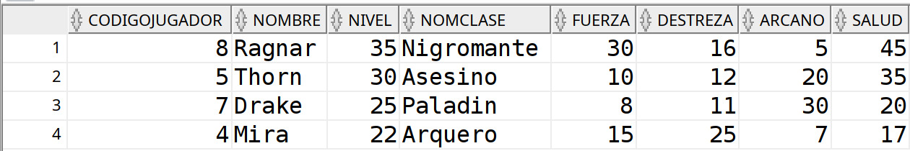

### Consulta 2
Obtiene el número total de ítems que posee cada jugador, incluyendo aquellos jugadores que no tengan ningún ítem. Además, se deberían mostrar únicamente los jugadores que hayan guardado la partida desde marzo de 2026 en adelante, ordenando el resultado de mayor a menor número de ítems.
```sql
SELECT 
    j.codigoJugador,
    j.nombre,
    j.fecha_guardado,
    COUNT(i.codItem) AS total_items
FROM JUGADOR j
LEFT JOIN INVENTARIO inv ON j.codigoJugador = inv.codigoJugador
LEFT JOIN ITEM i ON inv.codigoInventario = i.codigoInventario
WHERE j.fecha_guardado >= TO_DATE('2026-03-01','YYYY-MM-DD')
GROUP BY j.codigoJugador, j.nombre, j.fecha_guardado
ORDER BY total_items DESC;
```
Salida de la consulta:
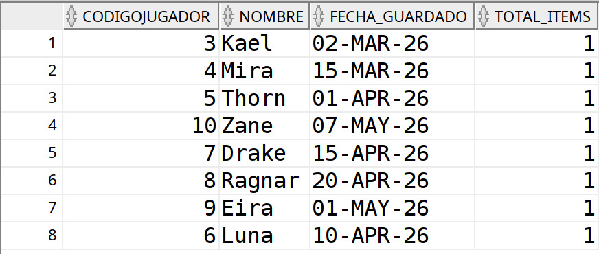

### Consulta 3
Calcula la media de probabilidad de drop de objetos para cada enemigo, mostrando todos los enemigos aunque no tengan drops asociados. Los resultados deben ordenarse de mayor a menor probabilidad media.
```sql

SELECT 
    e.codigoEnemigo,
    e.nombre,
    AVG(d.probabilidad) AS prob_media_drop
FROM ENEMIGO e
LEFT JOIN DROP_ENEMIGO_ITEM d 
    ON e.codigoEnemigo = d.codigoEnemigo
GROUP BY e.codigoEnemigo, e.nombre
ORDER BY prob_media_drop DESC NULLS LAST;

```
Salida de la consulta:
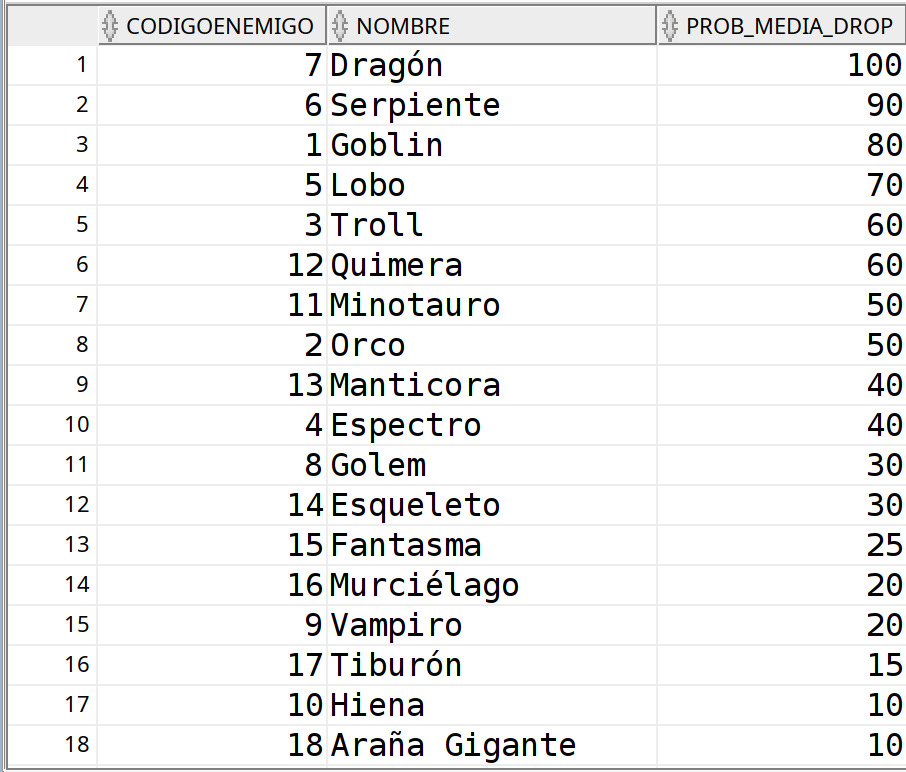

### Consulta 4
Lista las armas cuyo daño es superior a la media global de todas las armas. Además, se debería mostrar el número de copias disponibles de cada arma (si no tiene copias, mostraría 0), ordenando por daño de forma descendente.
```sql
SELECT 
    a.codItem,
    i.nomItem,
    a.dano,
    NVL(ca.numCopias, 0) AS copias
FROM ARMA a
INNER JOIN ITEM i ON a.codItem = i.codItem
LEFT JOIN COPIAS_ARMAS ca ON a.codItem = ca.codItem
WHERE a.dano > (
    SELECT AVG(dano) FROM ARMA
)
ORDER BY a.dano DESC;
```
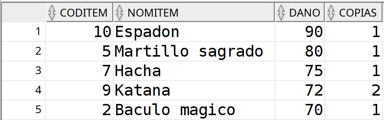

### Consulta 5
Muestra los jugadores junto con su clase, filtrando aquellos cuya fecha de guardado esté dentro de los últimos 30 días respecto a la fecha más reciente registrada en la base de datos. Los resultados deberían aparecer ordenados por fecha de guardado de forma descendente.

```sql
SELECT 
    j.codigoJugador,
    j.nombre,
    j.nivel,
    c.nomClase,
    j.fecha_guardado
FROM JUGADOR j
INNER JOIN CLASE c ON j.codigoClase = c.codigoClase
WHERE j.fecha_guardado >= (
    SELECT MAX(fecha_guardado) - 30 FROM JUGADOR
)
ORDER BY j.fecha_guardado DESC;
```
Salida de la consulta:
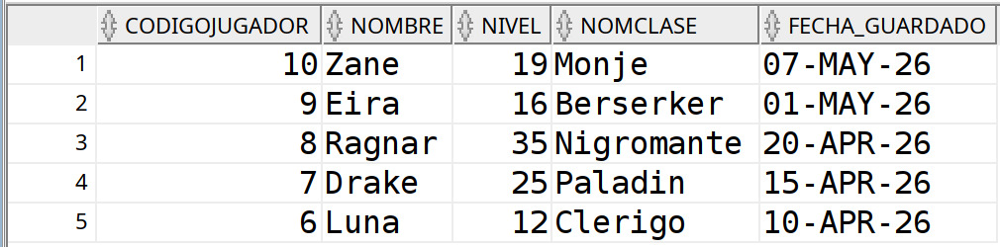


## Programación PLSQL

### Funciones

#### PLSQL_FUNCTION_DANO_TOTAL_JUGADOR

```sql
CREATE OR REPLACE FUNCTION PLSQL_FUNCTION_DANO_TOTAL_JUGADOR (v_codigoJugador jugador.codigojugador%type)
RETURN NUMBER
IS
    v_nombre_jugador jugador.nombre%type;
    v_dano_total arma.dano%type;
BEGIN

    SELECT nombre INTO v_nombre_jugador
    FROM JUGADOR
    WHERE v_codigoJugador = CODIGOJUGADOR;

    SELECT NVL(SUM(a.dano),0)
    INTO v_dano_total
    FROM JUGADOR j
    INNER JOIN INVENTARIO inv 
        ON j.codigoJugador = inv.codigoJugador
    INNER JOIN ITEM i 
        ON inv.codigoInventario = i.codigoInventario
    INNER JOIN ARMA a 
        ON i.codItem = a.codItem
    WHERE j.codigoJugador = v_codigoJugador;

    DBMS_OUTPUT.PUT_LINE('DAÑO TOTAL DEL JUGADOR ' || v_nombre_jugador ||': '||v_dano_total);
    RETURN v_dano_total;
    
    EXCEPTION
        WHEN NO_DATA_FOUND THEN
            DBMS_OUTPUT.PUT_LINE('NO SE HA ENCONTRADO EL JUGADOR');
            RETURN 0;
        WHEN OTHERS THEN
            DBMS_OUTPUT.PUT_LINE('SE HAN PRODUCIDO ERRORES');
            RETURN 0;
END;

```

Esta función calcula el daño total de las armas que posee un jugador dentro de su inventario.

La función recibe como parámetro el código del jugador y realiza varias composiciones internas (`INNER JOIN`) entre las tablas `JUGADOR`, `INVENTARIO`, `ITEM` y `ARMA` para obtener todas las armas asociadas al jugador y sumar su daño total mediante la función de agregación `SUM`.

En caso de que el jugador no posea armas, la función devuelve `0` utilizando `NVL`.

La función devuelve un valor numérico de tipo `NUMBER` y un mensaje.

Ejemplo de caso de uso:
```sql
DECLARE
    v_resultado NUMBER;
BEGIN

    v_resultado := PLSQL_FUNCTION_DANO_TOTAL_JUGADOR(3);

    DBMS_OUTPUT.PUT_LINE(v_resultado);

END;
```

Salida:
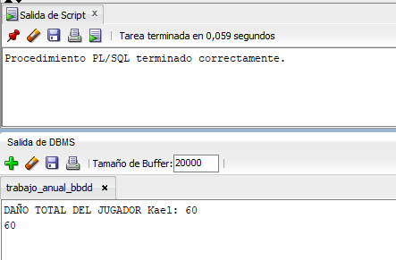

#### PLSQL_FUNCTION_RANGO_JUGADOR

```sql
CREATE OR REPLACE FUNCTION PLSQL_FUNCTION_RANGO_JUGADOR (v_codigoJugador jugador.codigoJugador%TYPE)
RETURN VARCHAR2
IS
    v_nivel jugador.nivel%TYPE;
    v_nombreJugador jugador.nombre%TYPE;
    v_rango VARCHAR2(30);
BEGIN

    SELECT NIVEL, NOMBRE INTO V_NIVEL, V_NOMBREJUGADOR
    FROM JUGADOR
    WHERE CODIGOJUGADOR = v_codigoJugador;

    IF v_nivel < 10 THEN
        v_rango := 'Principiante';

    ELSIF v_nivel BETWEEN 10 AND 20 THEN
        v_rango := 'Intermedio';

    ELSIF v_nivel BETWEEN 21 AND 30 THEN
        v_rango := 'Avanzado';

    ELSE
        v_rango := 'Legendario';
    END IF;

    DBMS_OUTPUT.PUT_LINE('RANGO DEL JUGADOR '||v_nombreJugador||': '|| v_rango);
    RETURN v_rango;
    
END;

```


Esta función recibe como parámetro el código de un jugador busca el nivel de dicho jugador para luego devolver un rango descriptivo relacionado con el nivel del jugador.

Los rangos definidos son:

- Menor de 10 → `Principiante`
- Entre 10 y 20 → `Intermedio`
- Entre 21 y 30 → `Avanzado`
- Mayor de 30 → `Legendario`

La función devuelve un mensaje con una variable `VARCHAR2` que contiene el valor del rango de los definidos.

Caso de uso:
```sql
DECLARE
    V_RESULTADO VARCHAR2(30);
BEGIN

    V_RESULTADO := PLSQL_FUNCTION_RANGO_JUGADOR(3);

    DBMS_OUTPUT.PUT_LINE(V_RESULTADO);

END;
```
Salida:
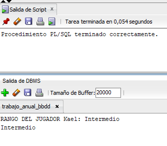

### Procedimientos

#### PLSQL_PROCEDURE_GUARDAR_PROGRESO_JUGADOR

```sql
CREATE OR REPLACE PROCEDURE PLSQL_PROCEDURE_GUARDAR_PROGRESO_JUGADOR (v_codigoJugador JUGADOR.codigoJugador%TYPE, v_nuevoNivel JUGADOR.nivel%TYPE)
IS
    v_nivel_actual JUGADOR.nivel%TYPE;
BEGIN

    SELECT nivel
    INTO v_nivel_actual
    FROM JUGADOR
    WHERE codigoJugador = v_codigoJugador;

    IF v_nuevoNivel >= v_nivel_actual THEN

        UPDATE JUGADOR
        SET 
            nivel = v_nuevoNivel,
            fecha_guardado = SYSDATE
        WHERE codigoJugador = v_codigoJugador;

        COMMIT;

        DBMS_OUTPUT.PUT_LINE('PROGRESO GUARDADO CORRECTAMENTE.');

    ELSE
        DBMS_OUTPUT.PUT_LINE('NO SE PUEDE REDUCIR EL NIVEL DEL JUGADOR.');
    END IF;

EXCEPTION

    WHEN NO_DATA_FOUND THEN
        DBMS_OUTPUT.PUT_LINE('JUGADOR NO ENCONTRADO.');

    WHEN VALUE_ERROR THEN
        DBMS_OUTPUT.PUT_LINE('ERROR DE TIPO DE DATO EN LOS VALORES INTRODUCIDOS.');

    WHEN OTHERS THEN
        DBMS_OUTPUT.PUT_LINE('SE HAN PRODUCIDO ERRORES');

END;
```
Caso de uso:
```sql
BEGIN

    PLSQL_PROCEDURE_GUARDAR_PROGRESO_JUGADOR(5, 34);

END;
```
Usuario a modificar antes de los cambios:
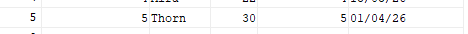
Salida:
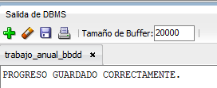
Cambios realizados representados en tabla:
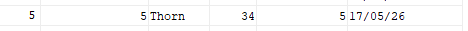


Este procedimiento permite guardar el progreso de un jugador dentro del sistema.

Recibe como parámetros el código del jugador y el nuevo nivel que se desea asignar.

Su funcionamiento es el siguiente:

1. Se obtiene el nivel actual del jugador desde la base de datos.
2. Se compara el nuevo nivel con el nivel existente.
3. Si el nuevo nivel es mayor o igual, se actualiza el registro del jugador.
4. Se actualiza también la fecha de guardado con la fecha actual del sistema.
5. Se confirma la operación mediante `COMMIT`.
6. Se muestran mensajes informativos mediante `DBMS_OUTPUT`.

En caso de que el usuario intente introducir un nivel inferior al que el `JUGADOR` ya tiene lanzará un mensaje como el siguiente:
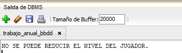

En caso de error, el procedimiento controla las siguientes excepciones:
- `NO_DATA_FOUND`: cuando el jugador no existe en la base de datos.
- `VALUE_ERROR`: cuando hay un error de tipo de dato en los valores introducidos.
- `OTHERS`: captura cualquier otro error no controlado, mostrando un mensaje genérico.

Imagen representativa de uno de los errores:
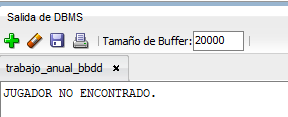


#### PLSQL_PROCEDURE_LISTAR_INVENTARIO_JUGADOR

```sql
CREATE OR REPLACE PROCEDURE PLSQL_PROCEDURE_LISTAR_INVENTARIO_JUGADOR (v_codigoJugador JUGADOR.codigoJugador%TYPE)
IS

    CURSOR cur_inv IS
        SELECT 
            i.codItem,
            i.nomItem,
            i.tipoItem,
            inv.tipoInventario
        FROM INVENTARIO inv
        INNER JOIN ITEM i
            ON inv.codigoInventario = i.codigoInventario
        WHERE inv.codigoJugador = v_codigoJugador;

    v_nombreJugador JUGADOR.nombre%TYPE;
    v_codItem        ITEM.codItem%TYPE;
    v_nomItem        ITEM.nomItem%TYPE;
    v_tipoItem       ITEM.tipoItem%TYPE;
    v_tipoInventario INVENTARIO.tipoInventario%TYPE;

BEGIN

    SELECT NOMBRE INTO V_NOMBREJUGADOR
    FROM JUGADOR
    WHERE V_CODIGOJUGADOR = CODIGOJUGADOR;

    OPEN cur_inv;
    DBMS_OUTPUT.PUT_LINE('INVENTARIO DE JUGADOR '||V_NOMBREJUGADOR||': ');
    LOOP
        FETCH cur_inv INTO 
            v_codItem,
            v_nomItem,
            v_tipoItem,
            v_tipoInventario;

        EXIT WHEN cur_inv%NOTFOUND;

        DBMS_OUTPUT.PUT_LINE(
            'ITEM: ' || v_codItem ||
            ' | ' || v_nomItem ||
            ' | TIPO: ' || v_tipoItem ||
            ' | INVENTARIO: ' || v_tipoInventario
        );
    END LOOP;

    CLOSE cur_inv;

EXCEPTION

    WHEN NO_DATA_FOUND THEN
        DBMS_OUTPUT.PUT_LINE('NO EXISTEN DATOS PARA ESE JUGADOR O NO EXISTE');

    WHEN VALUE_ERROR THEN
        DBMS_OUTPUT.PUT_LINE('ERROR DE TIPO DE DATO.');

    WHEN OTHERS THEN
        DBMS_OUTPUT.PUT_LINE('SE HAN PRODUCIDO ERRORES');

END;
```

Caso de uso:
```sql
BEGIN

    PLSQL_PROCEDURE_LISTAR_INVENTARIO_JUGADOR(7);

END;
```

Salida:
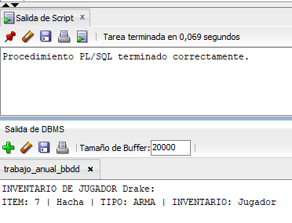

Este procedimiento muestra el inventario completo asociado a un jugador mediante el uso de un cursor explícito.

Recibe como parámetro el código del jugador.

Su funcionamiento es el siguiente:

1. Se define un cursor que recupera los ítems asociados al inventario del jugador.
2. Busca el nombre del jugador y lo introduce en una variable para imprimirlo mas tarde.
3. Se abre el cursor para comenzar la lectura de datos.
4. Se recorre cada fila del cursor de forma secuencial.
5. Por cada registro, se muestran los datos del ítem mediante `DBMS_OUTPUT`.
6. Se cierra el cursor una vez finalizada la lectura.

En caso de error, se contemplan las siguientes excepciones:
- `NO_DATA_FOUND`: si no se encuentra al jugador o no tiene datos.
- `VALUE_ERROR`: si ocurre un problema de tipo de datos.
- `OTHERS`: captura cualquier otro error no previsto, mostrando un mensaje genérico.

Ejemplo de error:
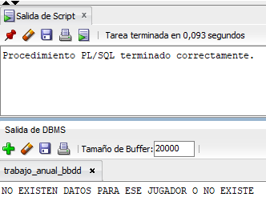

### Triggers 

#### ¿Qué son los triggers?

Los triggers son elementos que se enlazan a una tabla de la base de datos para que cuando el usuario trata de hacer una acción (`INSERT`, `UPDATE`, `DELETE`), automáticamente se produzcan otros cambios que sean necesarios antes o después de realizar la acción. 

Estos se ejecutan automáticamente sin la necesidad de ser llamados manualmente como las funciones o los procedimientos.

#### ¿Qué uso tienen?

Los triggers tienen distintos usos, como, por ejemplo, validar automáticamente nuevos valores introducidos, mantener la integridad de la tabla, automatización de tareas y para usos de auditoría.

Normalmente se usan sobre tablas como ya se ha comentado, sin embargo su uso se puede extender también a vistas.

#### Desventajas de los triggers

Aunque son útiles, también pueden complicar mucho una BBDD porque:
ejecutan una lógica prácticamente invisible, pueden causar errores difíciles de detectar, también encadenarse, afectando al rendimiento de consultas y otras tareas.
Por estas razones normalmente se usan para tareas concretas y no para meter toda la lógica de negocio.

#### Creación

Para crearlos habría que empezar la sentencia con:
```sql
CREATE OR REPLACE TRIGGER NOMBRE_TRIGGER
...
```

Luego habría que indicarle cuando queremos que se ejecute dicho trigger y la acción que tiene que ocurrir sobre la tabla para que se ejecute

```sql
BEFORE | AFTER
INSERT OR UPDATE OR DELETE
ON NOMBRE_TABLA
...
``` 

A continuación habría que definir cómo tiene que ser el tipo del trigger usando FOR EACH ROW o FOR EACH STATEMENT, `ROW` sirviendo para que se ejecute por cada fila afectada y `STATEMENT` para que se ejecute por cada sentencia SQL.

```sql
...
FOR EACH ROW | FOR EACH STATEMENT
...
``` 

Y ya se haría como con un bloque, procedimiento o función con `BEGIN` sus sentencias necesarias terminandolas en `END`. En estos bloques para detectar si un valor es antiguo o nuevo se usan las pseudovariables `:OLD` y `:NEW` respectivamente.

## Bases de datos no relacionales. Trabajo de investigación

### ¿Qué es una base de datos no relacional?

Las bases de datos no relacionales, o *NoSQL / NotOnlySQL*, son un sistema de gestión de bases de datos que no utiliza el modelo tradicional basado en filas y columnas ni depende de relaciones mediante claves foráneas.

En lugar de ello, emplea modelos de datos más flexibles como:

- Documentos (JSON o BSON)
- Clave-valor
- Columnas anchas
- Grafos

La teoría es sencilla: tienes una *clave* y un *valor. La clave es la que quieras y el valor suele ser un JSON, lo que amplía muchísimo la funcionalidad manteniendo una simplicidad que hace que sea más sencillo **escalarlas horizontalmente*.

El problema viene del mismo sitio: a la hora de hacer consultas complejas es bastante ineficiente y tienes que saber cómo vas a acceder a los datos para hacer algo tipo:  
Todos los empleados cuyo salario > 2000.

Además, al usar JSON, su estructura no está estandarizada, por lo que si no se decide internamente o se hace mal puede dar muchísimos problemas.

En la misma línea está el *particionado interno*: por cada clave se crea un hash que determina la posición de esa información dentro del servidor para luego acceder a la misma, razón por la cual también son más sencillas de escalar (simplemente puedes añadir otro servidor y distribuir en función del rango).

Es importante mencionar también que *NoSQL / NotOnlySQL* no necesariamente se refieren a lo mismo, ya que NotOnlySQL pretende ser una manera de *complementar* las bases de datos tradicionales más que sustituirlas.

Estas bases de datos están diseñadas para manejar grandes volúmenes de información, alta concurrencia y estructuras de datos dinámicas, siendo especialmente útiles en aplicaciones modernas como videojuegos, redes sociales o sistemas distribuidos.

---

| Aspecto                     | Bases de datos relacionales (SQL)                          | Bases de datos no relacionales (NoSQL)                     |
|----------------------------|------------------------------------------------------------|------------------------------------------------------------|
| Modelo de datos            | Tablas con filas y columnas                                | Documentos, clave-valor, grafos o columnas                 |
| Esquema                    | Fijo y predefinido                                         | Flexible y dinámico                                        |
| Relaciones                 | Uso intensivo de claves foráneas (JOINs)                   | Relaciones embebidas o referencias simples                 |
| Escalabilidad              | Vertical (más potencia en un solo servidor)                | Horizontal (distribución en varios servidores)             |
| Rendimiento                | Bueno en consultas complejas                               | Muy alto en grandes volúmenes y consultas simples          |
| Consistencia               | Alta (propiedades ACID)                                    | Variable (modelo BASE en muchos casos)                     |
| Flexibilidad               | Baja                                                       | Alta                                                       |
| Complejidad de consultas   | Baja en consultas complejas (JOINs disponibles)            | Mayor en consultas complejas                               |
| Redundancia de datos       | Baja (normalización)                                       | Mayor (desnormalización)                                   |
| Casos de uso ideales       | Sistemas financieros, ERP, aplicaciones críticas           | Big Data, tiempo real, videojuegos, redes sociales         |

---

Actualmente, las bases de datos NoSQL más utilizadas son:

- MongoDB
  - Modelo orientado a documentos
  - Muy utilizada en aplicaciones web y videojuegos

- Redis
  - Base de datos en memoria
  - Ideal para caché y sistemas en tiempo real

- Apache Cassandra
  - Altamente escalable
  - Usada en sistemas con grandes volúmenes de datos

- Amazon DynamoDB
  - Servicio gestionado en la nube
  - Alta disponibilidad

- Neo4j
  - Orientada a grafos
  - Ideal para relaciones complejas

---

- ¿Qué base de datos no-relacional escogerías si tuvieras qué migrar tu base de datos no-relacional a una no relacional? Justifica la respuesta.

Y cada vez se empuja más por la parte de cloud para que se usen, dado que son fácilmente escalables, con DynamoDB, BigTable y CosmosDB como ejemplos de los gigantes de la industria.

La base de datos no relacional que escogería para migrar el sistema desarrollado sería *MongoDB*.

La elección se justifica por varios motivos adaptados al contexto de un videojuego local (sin funcionalidad online):

En primer lugar, MongoDB permite trabajar con un modelo orientado a documentos (JSON), lo que facilita representar entidades complejas como los jugadores, sus estadísticas y su inventario en una única estructura. Esto simplifica considerablemente el diseño respecto al modelo relacional, donde la información está distribuida en múltiples tablas.

En segundo lugar, al tratarse de un videojuego local, el rendimiento en acceso a datos es clave. MongoDB permite acceder a toda la información de un jugador (estadísticas, clase, inventario) sin necesidad de realizar múltiples JOINs, reduciendo el tiempo de consulta y mejorando la eficiencia del sistema.

Además, la flexibilidad del esquema permite añadir fácilmente nuevos elementos al juego, como objetos, habilidades o estadísticas, sin necesidad de modificar la estructura de la base de datos. Esto resulta muy útil en el desarrollo de videojuegos, donde los cambios son frecuentes.

Aunque MongoDB está diseñado para entornos distribuidos, también funciona perfectamente en local, sin necesidad de aprovechar su escalabilidad horizontal, lo que lo convierte en una solución sencilla pero potente.

Por último, su facilidad de uso y la claridad de su estructura en formato JSON hacen que sea especialmente adecuada para proyectos de tamaño medio como este, donde prima la simplicidad y el mantenimiento.

En conclusión, MongoDB es una opción idónea para este caso, ya que permite simplificar el modelo de datos, mejorar el rendimiento en consultas y facilitar la evolución del videojuego, sin necesidad de una infraestructura compleja.