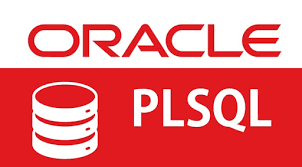
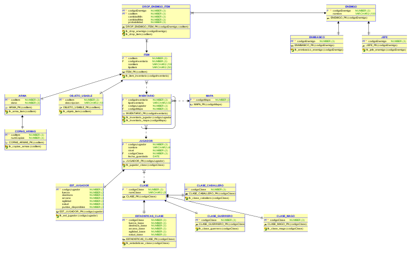
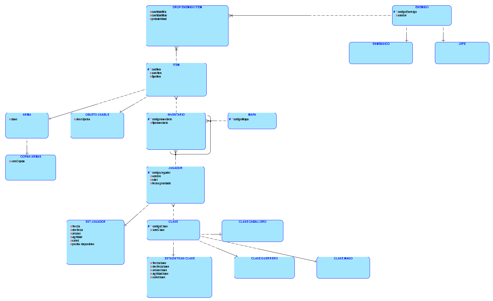

# Bases de Datos

# Cuarta entrega, Consultas y Procedimientos PL/SQL
#### Hecho por Jaime Castro y Jose Miguel Cenoz 1ºDAW


#
#
#
#
#
#
#

## Cambios Realizados sobre la tabla

### Modificación de la tabla `JUGADOR`

Se ha añadido un nuevo campo llamado `fecha_guardado` de tipo `DATE`.

#### Cambio realizado

```sql
fecha_guardado DATE
```

### Modelo Relacional y Lógico

Ya que en la entrega anterior no icluímos el modelo lógico dejamos tanto el modelo relacional como el lógico para tener la información necesaria sobre las tablas.

#### Modelo Relacional


#### Modelo Lógico


## Consultas realizadas sobre las tablas

### Consulta 1
Mostrar los jugadores junto con su clase y estadísticas, filtrando únicamente aquellos cuyo nivel sea superior a la media de todos los jugadores. Los resultados deben ordenarse de mayor a menor nivel.

### Consulta 2
Obtener el número total de ítems que posee cada jugador, incluyendo aquellos jugadores que no tengan ningún ítem. Además, se deben mostrar únicamente los jugadores que hayan guardado la partida desde marzo de 2026 en adelante, ordenando el resultado de mayor a menor número de ítems.

### Consulta 3
Calcular la media de probabilidad de drop de objetos para cada enemigo, mostrando todos los enemigos aunque no tengan drops asociados. Los resultados deben ordenarse de mayor a menor probabilidad media.

### Consulta 4
Listar las armas cuyo daño es superior a la media global de todas las armas. Además, se debe mostrar el número de copias disponibles de cada arma (si no tiene copias, mostrar 0), ordenando por daño de forma descendente.

### Consulta 5
Mostrar los jugadores junto con su clase, filtrando aquellos cuya fecha de guardado esté dentro de los últimos 30 días respecto a la fecha más reciente registrada en la base de datos. Los resultados deben aparecer ordenados por fecha de guardado de forma descendente.

```sql
-- =========================================================
-- CONSULTA 1: Jugadores con su clase, estadísticas y filtrado por nivel superior a la media
-- (INNER JOIN + SUBCONSULTA + ORDENACIÓN)
-- =========================================================

SELECT 
    j.codigoJugador,
    j.nombre,
    j.nivel,
    c.nomClase,
    ej.fuerza,
    ej.destreza,
    ej.arcano,
    ej.salud
FROM JUGADOR j
INNER JOIN CLASE c ON j.codigoClase = c.codigoClase
INNER JOIN EST_JUGADOR ej ON j.codigoJugador = ej.codigoJugador
WHERE j.nivel > (
    SELECT AVG(nivel) FROM JUGADOR
)
ORDER BY j.nivel DESC;


-- =========================================================
-- CONSULTA 2: Número de items por jugador (incluyendo jugadores sin items)
-- (LEFT JOIN + AGRUPACIÓN + FECHAS + ORDENACIÓN)
-- =========================================================

SELECT 
    j.codigoJugador,
    j.nombre,
    j.fecha_guardado,
    COUNT(i.codItem) AS total_items
FROM JUGADOR j
LEFT JOIN INVENTARIO inv ON j.codigoJugador = inv.codigoJugador
LEFT JOIN ITEM i ON inv.codigoInventario = i.codigoInventario
WHERE j.fecha_guardado >= TO_DATE('2026-03-01','YYYY-MM-DD')
GROUP BY j.codigoJugador, j.nombre, j.fecha_guardado
ORDER BY total_items DESC;


-- =========================================================
-- CONSULTA 3: Enemigos con media de probabilidad de drop de items
-- (LEFT JOIN + AGRUPACIÓN + ORDENACIÓN)
-- =========================================================

SELECT 
    e.codigoEnemigo,
    e.nombre,
    AVG(d.probabilidad) AS prob_media_drop
FROM ENEMIGO e
LEFT JOIN DROP_ENEMIGO_ITEM d 
    ON e.codigoEnemigo = d.codigoEnemigo
GROUP BY e.codigoEnemigo, e.nombre
ORDER BY prob_media_drop DESC NULLS LAST;


-- =========================================================
-- CONSULTA 4: Armas con daño superior al promedio general de armas
-- (INNER JOIN + SUBCONSULTA + LEFT JOIN + ORDENACIÓN)
-- =========================================================

SELECT 
    a.codItem,
    i.nomItem,
    a.dano,
    COALESCE(ca.numCopias, 0) AS copias
FROM ARMA a
INNER JOIN ITEM i ON a.codItem = i.codItem
LEFT JOIN COPIAS_ARMAS ca ON a.codItem = ca.codItem
WHERE a.dano > (
    SELECT AVG(dano) FROM ARMA
)
ORDER BY a.dano DESC;


-- =========================================================
-- CONSULTA 5: Jugadores con su clase y filtrado por los más recientes
-- (INNER JOIN + SUBCONSULTA + FECHAS + ORDENACIÓN)
-- =========================================================

SELECT 
    j.codigoJugador,
    j.nombre,
    j.nivel,
    c.nomClase,
    j.fecha_guardado
FROM JUGADOR j
INNER JOIN CLASE c ON j.codigoClase = c.codigoClase
WHERE j.fecha_guardado >= (
    SELECT MAX(fecha_guardado) - 30 FROM JUGADOR
)
ORDER BY j.fecha_guardado DESC;
```

## Programación PLSQL

### Funciones

### Procedimientos

### Triggers (Investigación)


## Bases de datos no relacionales. Trabajo de investigación

### ¿Qué es una base de datos no relacional?

Las bases de datos no relacionales, también conocidas como *NoSQL / Not Only SQL*, son sistemas de gestión de bases de datos que no utilizan el modelo tradicional basado en tablas (filas y columnas) ni dependen de relaciones mediante claves foráneas.

En su lugar, emplean modelos de datos más flexibles como:

- Documentos (JSON o BSON)  
- Clave-valor  
- Columnas anchas  
- Grafos  

Su funcionamiento se basa habitualmente en estructuras simples de *clave–valor*, donde la clave identifica el dato y el valor suele ser un JSON. Esto permite una gran flexibilidad y facilita la escalabilidad horizontal.

Sin embargo, esta simplicidad tiene implicaciones: las consultas complejas pueden ser menos eficientes y es necesario diseñar bien cómo se accederá a los datos desde el inicio. Además, al no existir un esquema rígido, una mala organización interna puede generar problemas de consistencia.

Otro aspecto importante es el *particionado interno*, donde cada clave se transforma en un hash que determina en qué servidor se almacena. Esto permite distribuir los datos fácilmente y escalar el sistema añadiendo más nodos.

Cabe destacar que *NoSQL* y *Not Only SQL* no son exactamente lo mismo:
- *NoSQL* → alternativa a las bases de datos relacionales  
- *Not Only SQL* → complemento a las bases de datos relacionales  

Estas bases de datos están diseñadas para manejar grandes volúmenes de información, alta concurrencia y estructuras dinámicas, siendo muy utilizadas en aplicaciones modernas como videojuegos, redes sociales o sistemas distribuidos.

---

### Ventajas y desventajas

| Aspecto                     | Bases de datos relacionales (SQL)                          | Bases de datos no relacionales (NoSQL)                     |
|----------------------------|------------------------------------------------------------|------------------------------------------------------------|
| Modelo de datos            | Tablas con filas y columnas                                | Documentos, clave-valor, grafos o columnas                 |
| Esquema                    | Fijo y predefinido                                         | Flexible y dinámico                                        |
| Relaciones                 | Uso intensivo de claves foráneas (JOINs)                   | Relaciones embebidas o referencias simples                 |
| Escalabilidad              | Vertical (más potencia en un solo servidor)                | Horizontal (distribución en varios servidores)             |
| Rendimiento                | Bueno en consultas complejas                               | Muy alto en grandes volúmenes y consultas simples          |
| Consistencia               | Alta (propiedades ACID)                                    | Variable (modelo BASE en muchos casos)                     |
| Flexibilidad               | Baja                                                       | Alta                                                       |
| Complejidad de consultas   | Baja en consultas complejas (JOINs disponibles)            | Mayor en consultas complejas                               |
| Redundancia de datos       | Baja (normalización)                                       | Mayor (desnormalización)                                   |
| Casos de uso ideales       | Sistemas financieros, ERP, aplicaciones críticas           | Big Data, tiempo real, videojuegos, redes sociales         |

---

### Bases de datos no relacionales más utilizadas

Actualmente, las bases de datos NoSQL más utilizadas son:

- MongoDB  
  - Modelo orientado a documentos  
  - Muy utilizada en aplicaciones web y videojuegos  

- Redis  
  - Base de datos en memoria  
  - Ideal para caché y sistemas en tiempo real  

- Apache Cassandra  
  - Altamente escalable  
  - Usada en sistemas con grandes volúmenes de datos  

- Amazon DynamoDB  
  - Servicio gestionado en la nube  
  - Alta disponibilidad  

- Neo4j  
  - Orientada a grafos  
  - Ideal para relaciones complejas  

Además, cada vez se impulsa más su uso en entornos cloud, con soluciones como DynamoDB, BigTable o CosmosDB.

---

### Elección de base de datos no relacional y justificación

La base de datos no relacional que escogería para migrar el sistema desarrollado sería *MongoDB*.

La elección se justifica por varios motivos adaptados al contexto de un videojuego local (sin funcionalidad online):

En primer lugar, MongoDB permite trabajar con un modelo orientado a documentos (JSON), lo que facilita representar entidades complejas como los jugadores, sus estadísticas y su inventario en una única estructura. Esto simplifica considerablemente el diseño respecto al modelo relacional, donde la información está distribuida en múltiples tablas.

En segundo lugar, al tratarse de un videojuego local, el rendimiento en acceso a datos es clave. MongoDB permite acceder a toda la información de un jugador sin necesidad de realizar múltiples JOINs, reduciendo el tiempo de consulta y mejorando la eficiencia.

Además, la flexibilidad del esquema permite añadir nuevos elementos al juego sin necesidad de modificar la estructura de la base de datos, lo cual es especialmente útil en entornos de desarrollo iterativo como los videojuegos.

Aunque MongoDB está diseñado para sistemas distribuidos, también funciona perfectamente en local, sin necesidad de aprovechar su escalabilidad horizontal.

Por último, su facilidad de uso y la claridad de su estructura en formato JSON lo convierten en una opción adecuada para proyectos de tamaño medio, donde prima la simplicidad y el mantenimiento.

En conclusión, MongoDB es una opción idónea para este caso, ya que permite simplificar el modelo de datos, mejorar el rendimiento y facilitar la evolución del sistema.