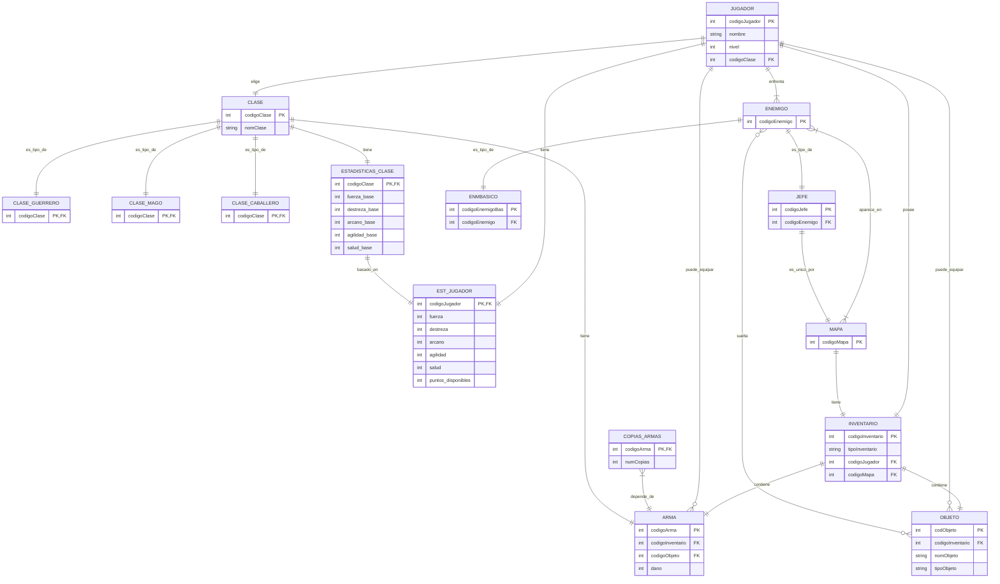
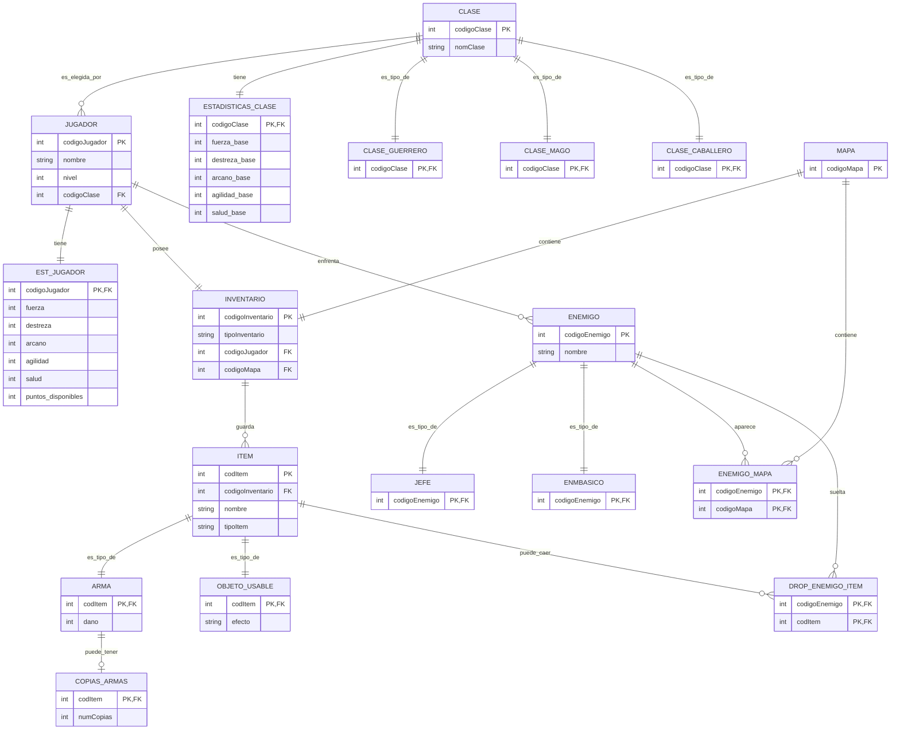

## Modelo Entidad Relación

### Resumen de modificaciones realizadas

#### 1. Creación de ITEM como entidad intermedia
- Se introduce `ITEM` como entidad base del sistema de inventario  
- INVENTARIO pasa a contener ITEM y no directamente ARMA u OBJETO_USABLE  
- Se evita redundancia estructural entre tipos de objetos  

#### 2. Especialización total y exclusiva de ITEM
- Todo ITEM debe ser obligatoriamente:
  - ARMA  
  - OBJETO_USABLE  
- No puede existir un ITEM genérico sin subtipo  
- Se aplica restricción conceptual XOR (disyunta y total)

#### 3. ARMA pasa a ser especialización real
- PK compartida (`codItem`)  
- Se elimina cualquier clave artificial propia  
- Hereda identidad directamente de ITEM  

#### 4. OBJETO_USABLE pasa a ser especialización real
- PK compartida (`codItem`)  
- Hereda identidad directamente de ITEM  

#### 5. COPIAS_ARMAS
- Se mantiene como entidad independiente  
- Depende de ARMA mediante PK compartida (`codItem`)  
- Permite modelar número de copias sin duplicar armas  

#### 6. ENEMIGO
- Se añade el atributo `nombre`  
- Mejora la coherencia semántica del modelo  

#### 7. JEFE y ENMBASICO
- Se mantienen como especializaciones reales  
- PK compartida con ENEMIGO  
- Especialización disyunta  

#### 8. Relación de drop corregida
- Se elimina relación directa ENEMIGO ↔ ITEM  
- Se introduce entidad asociativa `DROP_ENEMIGO_ITEM`  
- Se modela correctamente la relación N:M  

#### 9. Restricción conceptual mantenida
- Se mantiene restricción XOR en INVENTARIO  
  (Pertenece a jugador **o** a mapa)

---

Con esto el modelo queda consistente en especialización, normalización y control de restricciones estructurales.

## Modelo Relacional
| JUGADOR | |
|--------------|------------|
| codigoJugador | PK |
| nombre        |    |
| nivel         |    |
| codigoClase   | FK |

| CLASE | |
|--------------|------------|
| codigoClase | PK |
| nomClase    |    |

| CLASE_GUERRERO | |
|--------------|------------|
| codigoClase | PK, FK |

| CLASE_MAGO | |
|--------------|------------|
| codigoClase | PK, FK |

| CLASE_CABALLERO | |
|--------------|------------|
| codigoClase | PK, FK |

| ESTADISTICAS_CLASE | |
|--------------|------------|
| codigoClase   | PK, FK |
| fuerza_base   |    |
| destreza_base |    |
| arcano_base   |    |
| agilidad_base |    |
| salud_base    |    |

| EST_JUGADOR | |
|--------------|------------|
| codigoJugador | PK, FK |
| fuerza        |    |
| destreza      |    |
| arcano        |    |
| agilidad      |    |
| salud         |    |
| puntos_disponibles |    |

| INVENTARIO | |
|--------------|------------|
| codigoInventario | PK |
| tipoInventario   |    |
| codigoJugador    | FK |
| codigoMapa       | FK |

| ITEM | |
|--------------|------------|
| codItem          | PK |
| codigoInventario | FK |
| nomItem          |    |
| tipoItem         |    |

| ARMA | |
|--------------|------------|
| codItem       | PK, FK |
| dano          |    |

| OBJETO_USABLE | |
|--------------|------------|
| codItem       | PK, FK |
| descripcion   |    |

| COPIAS_ARMAS | |
|--------------|------------|
| codItem       | PK, FK |
| numCopias     |    |

| ENEMIGO | |
|--------------|------------|
| codigoEnemigo | PK |
| nombre        |    |

| ENMBASICO | |
|--------------|------------|
| codigoEnemigo | PK, FK |

| JEFE | |
|--------------|------------|
| codigoEnemigo | PK, FK |

| DROP_ENEMIGO_ITEM | |
|--------------|------------|
| codigoEnemigo | PK, FK |
| codItem       | PK, FK |
| cantidadMin   |    |
| cantidadMax   |    |
| probabilidad  |    |

| MAPA | |
|--------------|------------|
| codigoMapa | PK |

---

### Notas sobre el modelo relacional

1. `ITEM` es la entidad base que contiene `ARMA` y `OBJETO_USABLE` como especializaciones reales (PK compartida).  
2. `COPIAS_ARMAS` depende de `ARMA` mediante PK compartida (`codItem`).  
3. `DROP_ENEMIGO_ITEM` materializa la relación N:M entre `ENEMIGO` y `ITEM`, permitiendo atributos adicionales como probabilidad o cantidad.  
4. `INVENTARIO` contiene `ITEM` y mantiene restricción XOR: pertenece a un jugador **o** a un mapa.  
5. No existen relaciones directas redundantes entre `JUGADOR ↔ ITEM/ARMA/OBJETO_USABLE`.

# MODELO FÍSICO, INSERTS Y SELECTS

## USUARIO
-- COMENTARIO: creación de usuario y permisos
CREATE USER proyecto IDENTIFIED BY password;
GRANT CONNECT, RESOURCE TO proyecto;

---

## TABLAS FÍSICAS (6 destacadas)

### ITEM
-- COMENTARIO: Representa cualquier objeto del inventario, puede ser ARMA o OBJETO_USABLE
CREATE TABLE ITEM (
    codItem NUMBER(3) PRIMARY KEY,
    codigoInventario NUMBER(3) NOT NULL,
    nomItem VARCHAR2(100) NOT NULL,
    tipoItem VARCHAR2(50) NOT NULL CHECK (tipoItem IN ('ARMA','OBJETO_USABLE')),
    CONSTRAINT fk_item_inventario FOREIGN KEY (codigoInventario)
        REFERENCES INVENTARIO(codigoInventario)
);

### ARMA
-- COMENTARIO: Especialización total de ITEM
CREATE TABLE ARMA (
    codItem NUMBER(3) PRIMARY KEY,
    dano NUMBER(3) NOT NULL,
    CONSTRAINT fk_arma_item FOREIGN KEY (codItem)
        REFERENCES ITEM(codItem)
);

### COPIAS_ARMAS
-- COMENTARIO: Cantidad de copias de cada arma
CREATE TABLE COPIAS_ARMAS (
    codItem NUMBER(3) PRIMARY KEY,
    numCopias NUMBER(3) NOT NULL,
    CONSTRAINT fk_copias_armas FOREIGN KEY (codItem)
        REFERENCES ARMA(codItem)
);

### INVENTARIO
-- COMENTARIO: Puede pertenecer a un jugador o a un mapa (XOR)
CREATE TABLE INVENTARIO (
    codigoInventario NUMBER(3) PRIMARY KEY,
    tipoInventario VARCHAR2(50),
    codigoJugador NUMBER(3),
    codigoMapa NUMBER(3),
    CONSTRAINT fk_inventario_jugador FOREIGN KEY (codigoJugador)
        REFERENCES JUGADOR(codigoJugador),
    CONSTRAINT fk_inventario_mapa FOREIGN KEY (codigoMapa)
        REFERENCES MAPA(codigoMapa),
    CONSTRAINT chk_inventario_xor CHECK (
        (codigoJugador IS NOT NULL AND codigoMapa IS NULL) OR
        (codigoJugador IS NULL AND codigoMapa IS NOT NULL)
    )
);

### ENEMIGO
-- COMENTARIO: Representa todos los enemigos con nombre
CREATE TABLE ENEMIGO (
    codigoEnemigo NUMBER(3) PRIMARY KEY,
    nombre VARCHAR2(100) NOT NULL
);

### DROP_ENEMIGO_ITEM
-- COMENTARIO: Relación N:M entre ENEMIGO y ITEM
CREATE TABLE DROP_ENEMIGO_ITEM (
    codigoEnemigo NUMBER(3) NOT NULL,
    codItem NUMBER(3) NOT NULL,
    probabilidad NUMBER(3) DEFAULT 100,
    PRIMARY KEY (codigoEnemigo, codItem),
    CONSTRAINT fk_drop_enemigo FOREIGN KEY (codigoEnemigo)
        REFERENCES ENEMIGO(codigoEnemigo),
    CONSTRAINT fk_drop_item FOREIGN KEY (codItem)
        REFERENCES ITEM(codItem)
);

---

## INSERTS (al menos 10 por tabla)

-- CLASE
INSERT INTO CLASE VALUES (1,'Guerrero');
INSERT INTO CLASE VALUES (2,'Mago');
INSERT INTO CLASE VALUES (3,'Arquero');
INSERT INTO CLASE VALUES (4,'Asesino');
INSERT INTO CLASE VALUES (5,'Clerigo');
INSERT INTO CLASE VALUES (6,'Paladin');
INSERT INTO CLASE VALUES (7,'Nigromante');
INSERT INTO CLASE VALUES (8,'Berserker');
INSERT INTO CLASE VALUES (9,'Druida');
INSERT INTO CLASE VALUES (10,'Monje');

-- JUGADOR
INSERT INTO JUGADOR VALUES (1,'Aldric',15,1);
INSERT INTO JUGADOR VALUES (2,'Selene',20,2);
INSERT INTO JUGADOR VALUES (3,'Kael',18,3);
INSERT INTO JUGADOR VALUES (4,'Mira',22,4);
INSERT INTO JUGADOR VALUES (5,'Thorn',30,5);
INSERT INTO JUGADOR VALUES (6,'Luna',12,6);
INSERT INTO JUGADOR VALUES (7,'Drake',25,7);
INSERT INTO JUGADOR VALUES (8,'Ragnar',35,8);
INSERT INTO JUGADOR VALUES (9,'Eira',16,9);
INSERT INTO JUGADOR VALUES (10,'Zane',19,10);

-- ITEM
INSERT INTO ITEM VALUES (1,1,'Espada basica','ARMA');
INSERT INTO ITEM VALUES (2,2,'Baculo magico','ARMA');
INSERT INTO ITEM VALUES (3,3,'Arco largo','ARMA');
INSERT INTO ITEM VALUES (4,4,'Daga oscura','ARMA');
INSERT INTO ITEM VALUES (5,5,'Martillo sagrado','ARMA');
INSERT INTO ITEM VALUES (6,6,'Pocion salud','OBJETO_USABLE');
INSERT INTO ITEM VALUES (7,7,'Pocion mana','OBJETO_USABLE');
INSERT INTO ITEM VALUES (8,8,'Pergamino','OBJETO_USABLE');
INSERT INTO ITEM VALUES (9,9,'Bomba','OBJETO_USABLE');
INSERT INTO ITEM VALUES (10,10,'Anillo fuerza','OBJETO_USABLE');

-- ARMA
INSERT INTO ARMA VALUES (1,50);
INSERT INTO ARMA VALUES (2,70);
INSERT INTO ARMA VALUES (3,60);
INSERT INTO ARMA VALUES (4,55);
INSERT INTO ARMA VALUES (5,80);
INSERT INTO ARMA VALUES (6,45);
INSERT INTO ARMA VALUES (7,65);
INSERT INTO ARMA VALUES (8,75);
INSERT INTO ARMA VALUES (9,50);
INSERT INTO ARMA VALUES (10,90);

-- COPIAS_ARMAS
INSERT INTO COPIAS_ARMAS VALUES (1,2);
INSERT INTO COPIAS_ARMAS VALUES (2,1);
INSERT INTO COPIAS_ARMAS VALUES (3,3);
INSERT INTO COPIAS_ARMAS VALUES (4,2);
INSERT INTO COPIAS_ARMAS VALUES (5,1);
INSERT INTO COPIAS_ARMAS VALUES (6,2);
INSERT INTO COPIAS_ARMAS VALUES (7,1);
INSERT INTO COPIAS_ARMAS VALUES (8,3);
INSERT INTO COPIAS_ARMAS VALUES (9,2);
INSERT INTO COPIAS_ARMAS VALUES (10,1);

-- ENEMIGO
INSERT INTO ENEMIGO VALUES (1,'Goblin');
INSERT INTO ENEMIGO VALUES (2,'Orco');
INSERT INTO ENEMIGO VALUES (3,'Esqueleto');
INSERT INTO ENEMIGO VALUES (4,'Lobo');
INSERT INTO ENEMIGO VALUES (5,'Troll');
INSERT INTO ENEMIGO VALUES (6,'Bandido');
INSERT INTO ENEMIGO VALUES (7,'Araña gigante');
INSERT INTO ENEMIGO VALUES (8,'Dragón pequeño');
INSERT INTO ENEMIGO VALUES (9,'Murciélago');
INSERT INTO ENEMIGO VALUES (10,'Slime');

-- DROP_ENEMIGO_ITEM
INSERT INTO DROP_ENEMIGO_ITEM VALUES (1,1,100);
INSERT INTO DROP_ENEMIGO_ITEM VALUES (1,6,50);
INSERT INTO DROP_ENEMIGO_ITEM VALUES (2,2,100);
INSERT INTO DROP_ENEMIGO_ITEM VALUES (2,7,50);
INSERT INTO DROP_ENEMIGO_ITEM VALUES (3,3,100);
INSERT INTO DROP_ENEMIGO_ITEM VALUES (3,8,50);
INSERT INTO DROP_ENEMIGO_ITEM VALUES (4,4,100);
INSERT INTO DROP_ENEMIGO_ITEM VALUES (4,9,50);
INSERT INTO DROP_ENEMIGO_ITEM VALUES (5,5,100);
INSERT INTO DROP_ENEMIGO_ITEM VALUES (5,10,50);
INSERT INTO DROP_ENEMIGO_ITEM VALUES (6,1,30);
INSERT INTO DROP_ENEMIGO_ITEM VALUES (7,2,25);
INSERT INTO DROP_ENEMIGO_ITEM VALUES (8,3,40);
INSERT INTO DROP_ENEMIGO_ITEM VALUES (9,4,35);
INSERT INTO DROP_ENEMIGO_ITEM VALUES (10,5,20);

COMMIT;

---

## 5 SELECT DE DISTINTA COMPLEJIDAD

-- 1. SELECT simple: jugadores con su clase
SELECT j.nombre, c.nomClase
FROM JUGADOR j
JOIN CLASE c ON j.codigoClase = c.codigoClase;

-- 2. SELECT con JOIN múltiple: armas de cada jugador
SELECT j.nombre, i.nomItem, a.dano
FROM JUGADOR j
JOIN INVENTARIO inv ON j.codigoJugador = inv.codigoJugador
JOIN ITEM i ON inv.codigoInventario = i.codigoInventario
JOIN ARMA a ON i.codItem = a.codItem;

-- 3. SELECT con agregación: total armas por jugador
SELECT j.nombre, COUNT(a.codItem) AS total_armas
FROM JUGADOR j
JOIN INVENTARIO inv ON j.codigoJugador = inv.codigoJugador
JOIN ITEM i ON inv.codigoInventario = i.codigoInventario
JOIN ARMA a ON i.codItem = a.codItem
GROUP BY j.nombre;

-- 4. SELECT con condición: enemigos con drop >50%
SELECT e.nombre, d.codItem, d.probabilidad
FROM ENEMIGO e
JOIN DROP_ENEMIGO_ITEM d ON e.codigoEnemigo = d.codigoEnemigo
WHERE d.probabilidad > 50;

-- 5. SELECT con subconsulta: jugadores con nivel superior al promedio
SELECT nombre, nivel
FROM JUGADOR
WHERE nivel > (SELECT AVG(nivel) FROM JUGADOR);