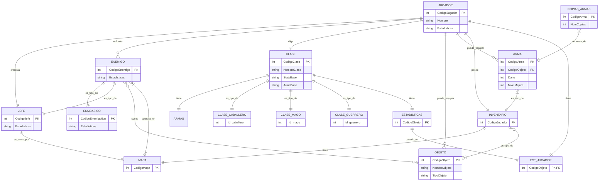

# Bases de Datos 
## Proyecto Anual Segunda Entrega

##### Hecho por Jaime Castro y José Miguel Cenoz, 1ºDAW

## Índice

1. [Descripción del Sistema](#descripción-del-sistema)
2. [Requisitos del Sistema](#requisitos-del-sistema)
    - [Funcionales](#funcionales)
    - [No Funcionales](#no-funcionales)
        - [Estudio SGBD a usar](#estudio-SGBD-a-usar)
        - [Funcionamiento de _BBDD_ distribuida](#funcionamiento-de-_BBDD_-distribuida)
        - [Ubicación de los datos o Almacenamiento Físico](#ubicación-de-los-datos-o-almacenamiento-físico)
        - [Crecimiento](#crecimiento)
        - [Plan de respaldo](#plan-de-respaldo)
3. [Bibliografía](#bibliografía)

## Descripción del Sistema
Una compañía de videojuegos ha desarrollado un juego en el que se controla un personaje y tienes que derrotar distintos jefes, ubicados en el mapa del juego. 
Se quiere recoger información del jugador, jefes, ubicaciones del mapa, armas, objetos y enemigos básicos.

## Requisitos del sistema
### Funcionales
# Requisitos funcionales

1. Gestión de jugadores
- El sistema debe permitir crear, modificar y eliminar jugadores con un CodigoJugador, Nombre y Estadisticas.
- Cada jugador debe elegir una clase al ser creado.
- Cada jugador debe tener su inventario y estadísticas asociadas.
- Los jugadores pueden equipar armas y objetos.

2. Clases y especializaciones
- El sistema debe manejar distintas clases de personaje.
- Cada clase tiene estadísticas base y un arma base.
- Las clases pueden ser especializadas en Guerrero, Mago o Caballero.
- Cada jugador puede tener solo una clase activa, aunque la clase puede no tener jugadores asignados.

3. Objetos y armas
- El sistema debe permitir crear y gestionar objetos con CodigoObjeto, NombreObjeto y TipoObjeto.
- Cada arma debe estar vinculada a un objeto base y tener atributos como Dano y NivelMejora.
- El sistema debe controlar las copias de armas disponibles en el juego.
- Los jugadores pueden equipar objetos y armas, y estos pueden estar almacenados en el inventario.

4. Estadísticas
- Los jugadores y las clases deben tener estadísticas asociadas.
- Las estadísticas deben reflejar atributos base de la clase o mejoras obtenidas por objetos.

5. Enemigos y jefes
- El sistema debe permitir crear enemigos y diferenciarlos en jefes y enemigos básicos.
- Cada enemigo puede soltar objetos.
- Los enemigos y jefes aparecen en mapas específicos.
- Cada jugador puede enfrentarse a enemigos y jefes.

6. Mapas
- Cada mapa debe contener un inventario y enemigos.
- Cada jefe es único por mapa.
- El sistema debe poder listar enemigos y jefes que aparecen en un mapa determinado.

7. Inventario
- El inventario debe asociarse a un jugador y a un mapa.
- Debe permitir almacenar objetos y armas.
- Debe reflejar qué objetos y armas están actualmente equipados por el jugador.

### No funcionales
Se ha seleccionado para esta tarea, una base de datos relacional, ya que los datos de un videojuego, mantienen una relación natural entre entidades participantes del medio.

Se hacen referencias constantes entre tablas, por ejemplo transacciones o reglas (enemigo no deja arma si no es eliminado por jugador, por ejemplo). 

Usando el modelo relacional es posible conseguir diseño, integridad y consultas. Siendo estas últimas un método eficiente para recuperar información sobre la experiencia, por ejemplo si hay zonas demasiado diİciles, comparando las veces que el jugador ha sido eliminado en una zona concreta, cuáles son las armas mas usadas etc.

#### Estudio _SGBD_ a usar
Hay varias opciones a la hora de seleccionar el _SGBD_ que más nos convene para este sistema de información. Entre ellos hemos seleccionado `MySQL`, `SQLite`, `PostgreSQL` y `Oracle`.
- **`MySQL`**: gran facilidad de uso y rednimiento. Tiene soporte multiplataforma, lo que permite trabajar con los archivos del juego fácilmente, y mantiene la comunicación segura entre navegador y servidor mediante su soporte `SSL`. El mayor problema es que no es escalable, por lo que si se quieren realizar cambios, podría no ser la mejor opción.

- **`SQLite`** nos permite guardar toda esta información fácilmente, aunque su tamaño sea mucho menor que cualquier otro al tratarse de una biblioteca, su gran portabilidad y rendimiento nos permite usar este sistema para trabajar con la _BBDD_.

- **`PostgreSQL`**: gran capacidad de uso multiplataforma y herramientas que permiten administrar fácilmente la _BBDD_. Este _SGBD_ es robusto y eficaz, pero al mismo tiempo, nos permite realizar una configuración compatible con _BBDD_ más pequeñas. También, al ser un sistema que permite el uso multiplataforma, podemos manejar `JSON` o `CTE`,(prominentes en el desarrollo de videojuegos), cosa especialmente útil, cuando se trata de sistemas de inventario.

- **`Oracle`**, por otro lado, es más completo. Por lo que sería perfecto si se tratara de una base de datos que estuviera en constante evolución, ya que tiene una gran escalabilidad. Sin embargo, éste no es el caso, por lo que no es el _SGBD_ que más nos conviene, aunque tenga buenas características para uso empresarial.

En conclusión, por todo lo anteriormente descrito, nos decantamos por usar el _SGBD_ de **`PostgreSQL`**; por su capacidad de personalización, manejo de `JSON/CTE`, gran uso multiplataforma etc.
#### Funcionamiento de BBDD distribuida
Esta _BBDD_  funcionaría en una distribuida, aunque no tendría sentido más allá de la seguridad de la información, ya que la _BBDD_ se ejecutaría en la máquina personal del jugador. Sin embargo, si se tratará de un juego en línea, dónde las actualizaciones son constantes, podría ser preferible, para que la máquina del jugador no tenga que ejecutar dicha _BBDD_, puesto que pueden llegar a alcanzar tamaños enormes.

#### Ubicación de los datos o Almacenamiento Físico
La empresa tendría un servidor central para ubicar la base de datos principal del juego, en el que se guardarían absolutamente todos los datos de la misma. Cada jugador tendría su propia copia del mismo, pero con los datos actualizados de su partida. 
Si se hiciera alguna actualización del juego, sería mediante un _script_ de migración, que en resumen es un _script_ _SQL_ que sirve para hacer cambios en una base de datos de forma segura (en el transcurso de actualizaciones). 
Esto se haría en caso de que se añada o elimine algún arma del juego, o para contenido extra del juego.
Cabe mencionar que se puede dar el caso de que haya un riesgo de incompatibilidad de versión, si un jugador no actualiza el juego cuando se distribuya una actualización, su _BBDD_ quedaría desactualizada, por lo que los datos podrían no coincidir con la versión que se publica, o parche actual de la empresa.
#### Crecimiento
No se prevé un gran crecimiento de esta base de datos, sin embargo, si la compañía desea hacer actualizaciones o ampliaciones de contenido (como contenido descargable, o una continuación del mismo). Se podría usar esta _BBDD_ de plantilla.

#### Plan de respaldo
Al tratarse de una base de datos pequeña y que se actualiza poco, no es necesario un plan de respaldo especialmente complejo (solamente que el jugador guarde su partida antes de salir del juego). Sin embargo, también se podría plantear, que la empresa distribuidora del juego permitiera autoguardados en la nube de las partidas de los distintos jugadores, por lo que si un jugador pierde su partida, o esta se corrompe pueda recuperarla fácilmente.

## Modelo Entidad Relación

## Bibliografía
Parte de la información que hemos expuesto está en internet y otra en los apuntes de
clase, las fuentes son las siguientes:
- https://www.red-gate.com/blog/a-database-model-for-action-games?.com
- https://learn.microsoŌ.com/en-us/sql/relational-databases/databases/estimate-the-size-of-a-database?view=sql-server-ver17
- http://Postgresql.org
-  https://docs.aws.amazon.com/wellarchitected/latest/games-industry-
- lens/games-scenario-4.html?.com
- https://knowledgebase.apexsql.com/migration-scripts-introduction-and-general-review/?_x_tr_sl&_x_tr_tl&_x_tr_hl
También dejamos acceso a información sobre el juego en el que nos hemos basado para contrastar información sobre el trabajo que estamos realizando.
- https://darksouls.fandom.com/es/wiki/Dark_Souls_III
